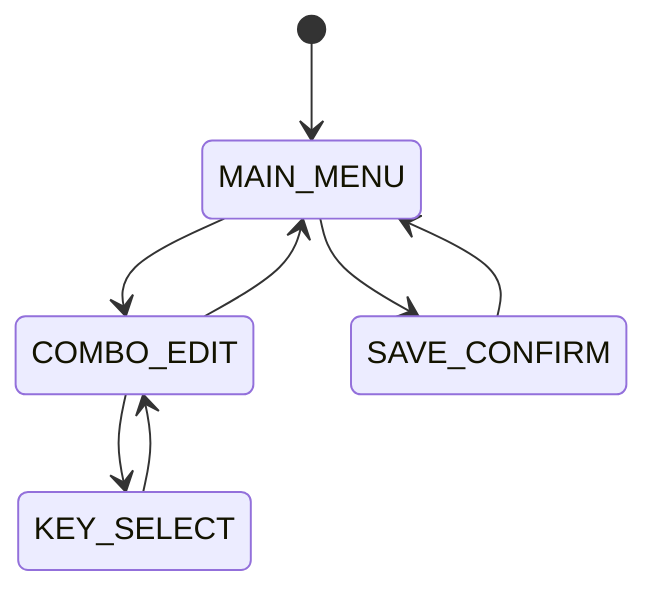

# KiBoard Documentation

## Hardware Configuration

### Pin Assignments
| Component | Pin | Description |
|-----------|-----|-------------|
| LCD_DC    | GP16| LCD Data/Command |
| LCD_CS    | GP17| LCD Chip Select |
| LCD_RST   | GP18| LCD Reset |
| LCD_BL    | GP19| LCD Backlight |
| TOUCH_RST | GP20| Touch Reset |

### Display
- ILI9341 2.8" TFT LCD
- Resolution: 240x320 pixels
- SPI Interface
- 16-bit Color

### Touch Controller
- FT6236 Capacitive Touch
- I2C Interface
- Resolution: 240x320
- Multi-touch support

## EEPROM Layout
| Address Range | Size | Description |
|--------------|------|-------------|
| 0x00 - 0x63  | 100  | Combo mappings |
| 0x64         | 1    | Config mode flag |
| 0x65 - 0x67  | 3    | Reserved |
| 0x68 - 0xFF  | 152  | Custom settings |

## State Machine


## Function Documentation

### Configuration Mode
```c
bool is_config_mode(void)
```
Returns true if keyboard is in configuration mode.

```c
void enter_config_mode(void)
```
Enters configuration mode and stores state in EEPROM.

```c
void exit_config_mode(void)
```
Exits configuration mode and clears EEPROM flag.

### Display Interface
```c
void init_config_display(void)
```
Initializes LCD and touch controller.
Returns: None
Errors: Displays error message on screen if initialization fails

```c
void run_config_interface(void)
```
Main loop for configuration interface.
- Reads touch input
- Updates UI state
- Refreshes display

### UI Management
```c
void process_touch_input(uint16_t x, uint16_t y)
```
Processes touch coordinates and triggers UI actions.
Parameters:
- x: X coordinate (0-239)
- y: Y coordinate (0-319)

```c
bool validate_state_transition(ui_state_t new_state)
```
Validates UI state transitions.
Returns: true if transition is allowed

## Error Handling

### Display Initialization
1. Check LCD initialization
2. Display error message if touch fails
3. Fallback to normal keyboard mode

### Touch Input
1. Validate coordinates
2. Debounce inputs
3. Handle multi-touch errors

### EEPROM Operations
1. Verify write operations
2. Maintain checksum
3. Handle corruption

## Building and Flashing

### Requirements
- QMK Firmware
- ARM GCC Toolchain
- Python 3.6+

### Build Commands
```bash
qmk compile -kb kiboard
```

### Flash Commands
```bash
qmk flash -kb kiboard
```
